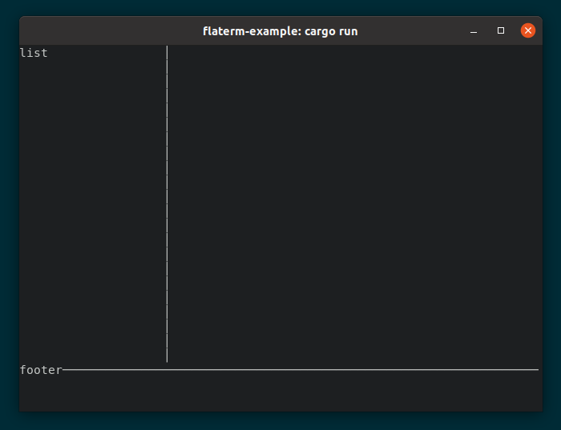

# flaterm

Terminal UI toolkit with Minimal design.

## Usage



```rust
let layout = layout! {
    <Block title="flaterm-example">
        <Block title="header" height=6 />
        <Block title="content" />
        <Block title="footer" height=3 />
    </Block>
};
let area = f.size();
flaterm::render(&layout, f, area);
```

## Features

- [JSX](https://reactjs.org/docs/introducing-jsx.html)-like declarative UI construction
- Layout by [flexbox](https://developer.mozilla.org/en-US/docs/Learn/CSS/CSS_layout/Flexbox)
- Widgets
- Themes
- [crossterm](https://github.com/crossterm-rs/crossterm) backend

## Themes

- `tui` (default)
- `flat` (under development)

## TODOs

- [ ] Support border configuration
- [ ] Support boolean props
- [ ] Widgets
  - [ ] Log
  - [ ] Tab
- [ ] Create `flat` theme
- [ ] CI (github actions)

## License

MIT

## Author

Yuki Kodama / [@kuy](https://twitter.com/kuy)

## Acknowledgements

- [yew-macro](https://github.com/yewstack/yew/tree/master/packages/yew-macro)
